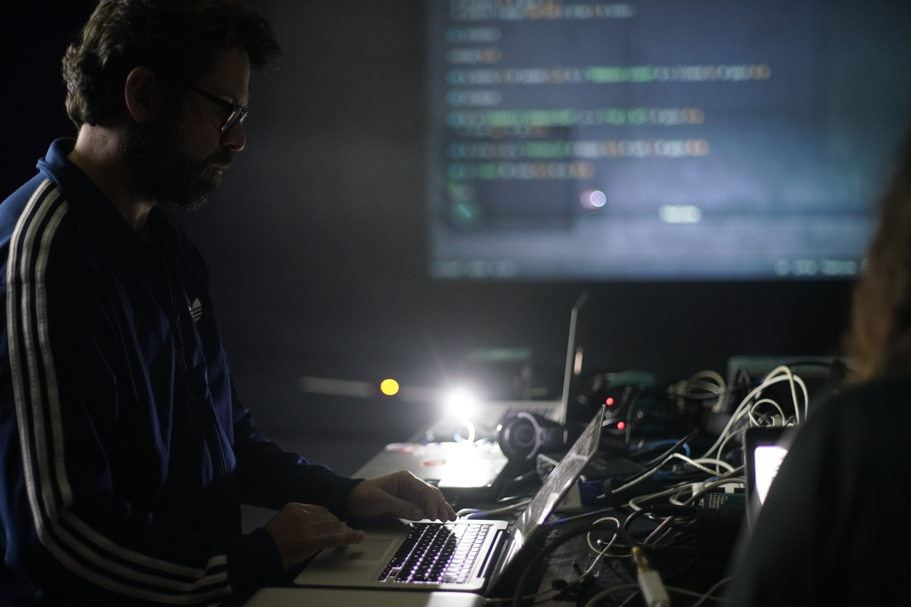

# QBRNTHSS

QBRNTHSS (pronounced “quebrantahuesos”, meaning “bearded vulture” in Spanish) is the alias that Ramon Casamajó, musician and educator, uses for his solo works focused on electronics and live coding. As QBRNTHSS he has just released his first LP on the Sheffield label Interworld Media, and is actively involved in the TOPLAP Barcelona collective. He has played in international events and venues like Ars Electronica 2020, Sónar VIU 2021, Iklectik London, Algorithmic Art Assembly 2022, as well as in online events hosted by the international TOPLAP community. He also runs the micro record label Call It Anything Records. “The Magic Words Are Squeamish Ossifrage” (the plain text solution to many cryptographic challenges, a tradition originated in a challenge set by the authors of the RSA encryption algorithm in 1977) is his first full-length album as QBRNTHSS, the result of more than a year of live performances and rehearsals using Tidal Cycles and Supercollider (live coding languages) as main instruments. Aesthetically it’s a mixture of synthetic textures, noisy ambients and broken rhythms.

Links:

- <http://callitanything.org/>
- <https://interworldmedia.bandcamp.com/album/the-magic-words-are-squeamish-ossifrage> 

