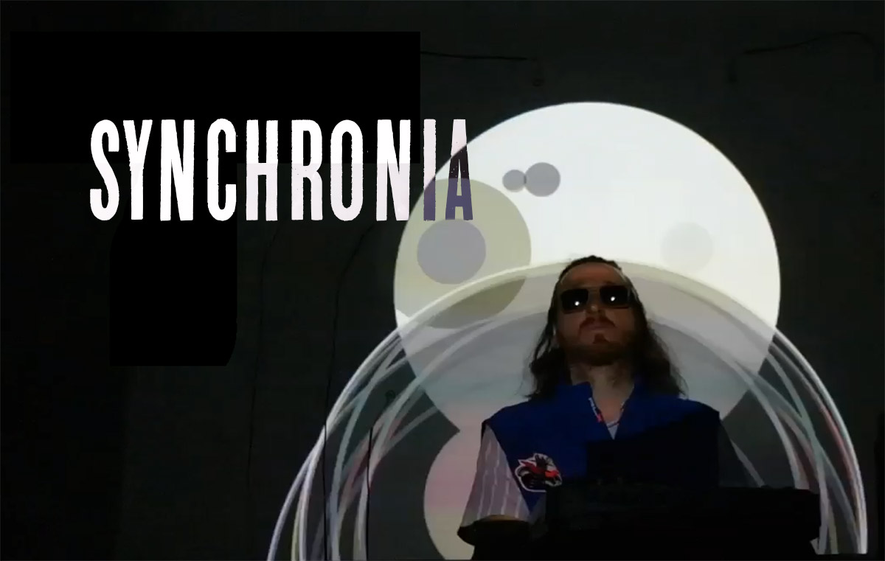

# Alfonsofonso

El meu nom és Alfonso Pardo Zapatero, vaig néixer pèl roig al madrileny barri de Carabanchel el 5 de Febrer de 1975 i soc adicte a fer música.

Els meus pares van detectar la meva predisposició aprenent a tocar la flauta i em van aconseguir primer una melòdica, també un casiotone i després un orgue amb els quals gaudia molt tocant. Però em van apuntar a estudiar al Conservatorio de Madrid i em vaig traumatitzar tocant el violí i vaig deixar-ho. Als onze anys van traslladar el meu pare a Barcelona on he viscut als barris de Les Corts i de Sants. Em vaig emancipar i des de fa 18 anys visc a la ciutat de Cornellà de Llobregat.

A l'institut vaig retomar amb més assiduïtat la meva activitat musical i vaig formar un grup de grunge-rock anomenat Evasión per tocar amb els amics les meves cançons. Desde llavors no he deixat mai de tocar en grups, jams i d'altres formats.Vaig formar part de Turbio Verano una banda eclèctica on exploràvem diferents estils i vam acabar fent una barreja de cançó electrònica-soul-pop molt experimental que tocàvem per Barcelona.

Al 2005 vaig guanyar el concurs andorrà Carles Sabater i també el concurs Sona9 de Tv3 en la modalitat de cançó d'autor amb un grup que vaig formar anomenat Carnal. Vam gravar un disc amb el segell Discmedi-Blau, vam fer un videoclip i una petita gira. La formació es va dissoldre, com sol passar, per culpa dels típics problemes que tenen els grups (principalment el meu ego).

Ja a Cornellà, vaig muntar un grup anomenat El Ataque ye-yé (ja s'auto-explica el nom...)
També vaig formar part dels Qbits: una banda de ciber-punk molt divertida. Amb totes dues agrupacions vam tocar a les festes majors i a d'altres indrets no deixant a ningú indiferent.

Més tard he continuat fent música de vegades en solitari, de vegades en col·laboracions, assistint i organitzant jam sessions cada setmana i composant temes de tant en tant que he anat pujant a les xarxes, sobretot a Youtube on tinc un canal amb moltes incursions…

Els últims anys també he explorat la música algorítmica (a causa dels defectes adquirits treballant com a programador informàtic) i formo part del col·lectiu TopLap Barcelona on ens trobem en "algoraves" per fer música amb codi. He programat la meva web (lalluvia.com) per poder fer-la servir per experimentar i crear música d'aquesta manera, on a més introdueixo visuals projectats perque l'espectacle sigui més entretingut.

Aquest és un currículum artístic, he treballat però en d'altres camps a part de la música, per veure el c.v. amb que busco feina no relacionada amb la música aneu a linkedin aquí: www.linkedin.com/in/alfonsofonso. Ara mateix segueixo tocant tots els dies, flauta, guitarra, baix, pc, etc, pero sobretot piano, estudiant, practicant, improvisant i composant obres musicals. Ben sovint però, surto a barrejar-me amb poetes, ballarins, i artistes de tota mena en el circuit underground barceloní.

Em podeu trobar a la majoria de xarxes sota el nom: alfonsofonso 

Links:

- <https://youtube.com/playlist?list=PLRY1LA2rF-HLxzE3KRQ-oxbGnNpOehYIC> 

