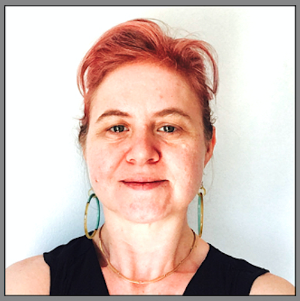
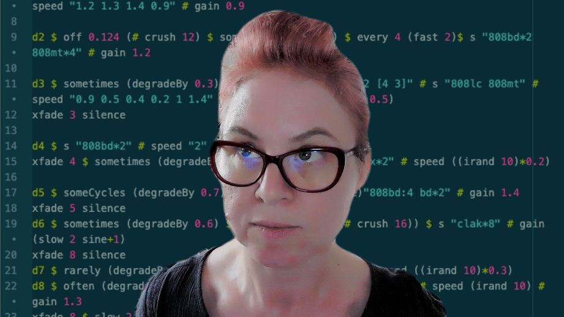

# Alicia Champlin

Alicia Champlin (USA, 1975) is an independent intermedial artist and researcher based in Barcelona. Champlin’s creative practices have come to focus on feedback-driven, generative systems in pursuit of the phenomenological intersection of networked communication and identity. In installations, she applies systems theory to employ sound and interaction in modeling complex and dynamic relationships to explore cybernetic and post-structuralist issues of communication. She also has performance practices both with live-coding (primarily TidalCycles) and with the bow chime (a.k.a. steel cello), which sometimes intersect. Champlin is an active member of the TOPLAP Barcelona community. She received her MFA from the University of Maine and has worked in such contexts as Sònar Festival (ES), Cabaret Voltaire (CH), Algorithms That Matter (ALMAT), BEK (NO), IEM (AT), and PIFcamp (SI).

Links:

- <https://youtu.be/tMbPaq7kjsM&t=4767s> 
- <https://youtu.be/klNe5sVxFTc&t=8212s> 

