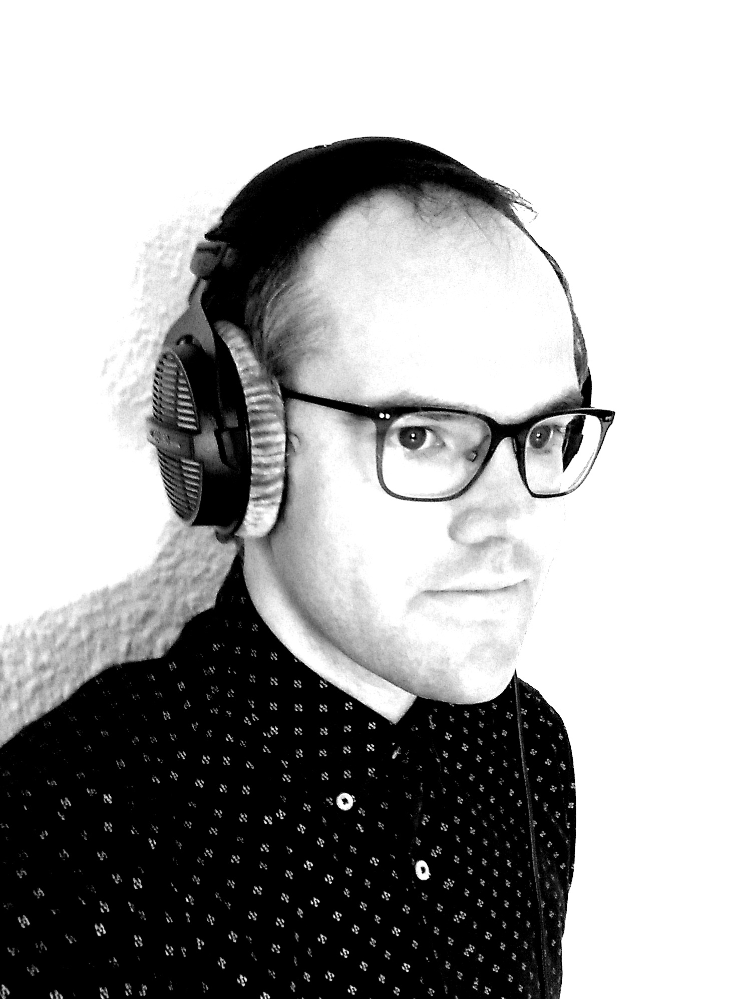

# Niklas Reppel

I'd put myself on the list for one of the audio slots :)

Bio:

Niklas Reppel (*1983 in Witten, Germany) is (in no particular order) a programmer, live coder, sound artist, composer, musician, and committed eclecticist. He has been based in Barcelona since 2017, where he found a home in the local TOPLAP node.

Having played in a variety of music ensembles in the distant past (ranging from jam-oriented rock bands to contemporary chamber music groups and everything in between), his current (sound) art practice draws influence from improvisational music, the the everyday sound around him, and the beauty of Markov chains. He spends a lot of time making live coding environments (i.e. Mégra, his main performance language) to facilitate his workflows in sound art, improvisational performance on multichannel setups, or plain old algorave.

Links:
<https://github.com/the-drunk-coder/megra.rs>
<https://vimeo.com/user37414592>

