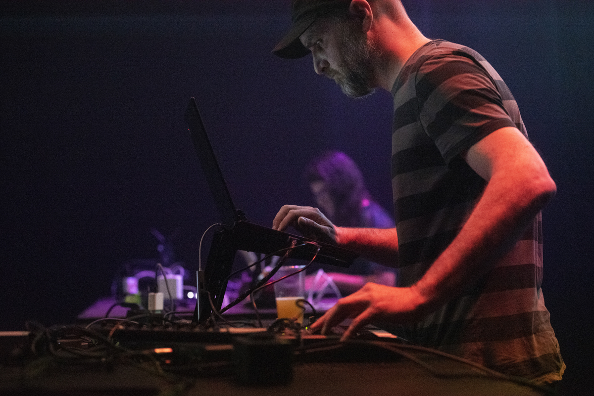

# Roger Pibernat

Roger Pibernat is an illustrator and musician with a severe tinkering itch. He was part of the Barcelona Laptop Orchestra and co-founded the Wú collective, with whom he has developed electro-acoustic instruments and experimental software. He’s the developer of the live coding dialect for SuperCollider (Živa). He is currently an active member of the live coding community in Barcelona. In all of his inventions, he tries to find ways to connect apparently unrelated systems, making things talk. Teaming up with artist and programer Glen Fraser, they have developed Animatron as a playground for performatic and improvisational visual poetry with 2D animation.

Links

- <https://www.rogerpibernat.com/>
- <https://github.com/loopier/ziva>
- <https://github.com/loopier/animatron>
- <https://wucollective.com/>

Photo by Katja Goljat -- [download high resolution](https://my.hidrive.com/lnk/v7iAGLA)
