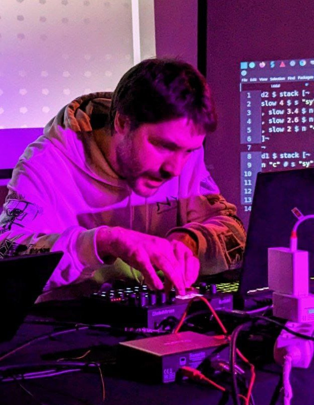

# Savamala

Savamala is the artistic alias of Joan Queralt, mathematician and computer science teacher from 
Terrassa.  With a lifelong fascination for digital culture and coding, Savamala has found in live-coding an artistic way of expressing 
himself that perfectly aligns with his way of thinking. As a long-time free 
software advocate, Joan actively collaborates on the documentation efforts of TidalCycles, and co-organizes a weekly collaborative live-coding jam. Recently, he has participated in the VIU festival, in Barcelona, both 
as a musician and as a visualist.

Links:

- <https://soundcloud.com/savamala> 

