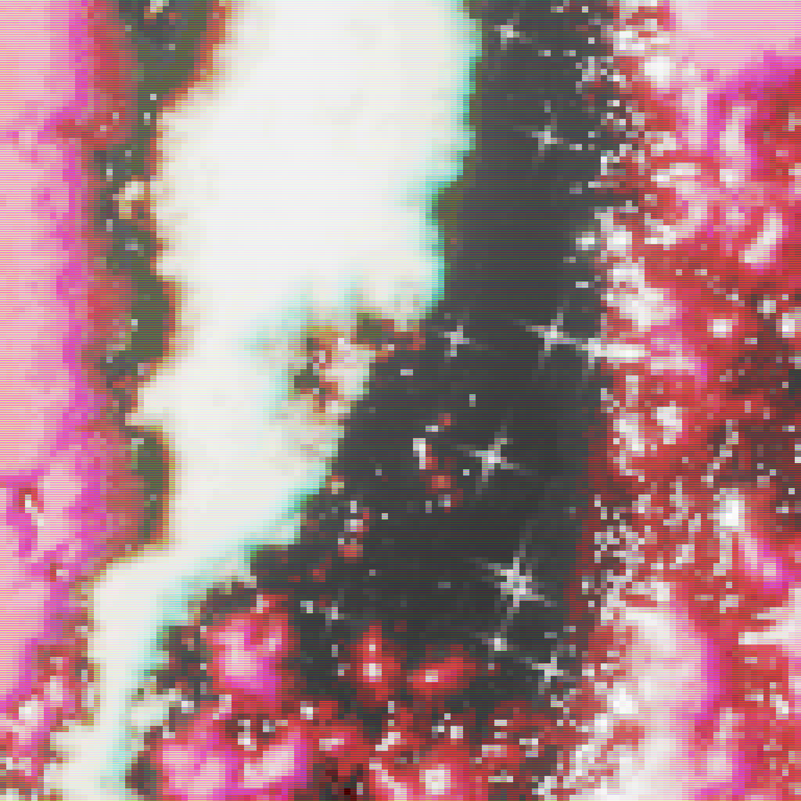

# Xiwire

Coming from Caracas, Venezuela, xiwire deals high-intensity sets bringing together multiple sources of inspiration: the Internet’s underground, industrial music and 90s raves, searching for a mix of hard-hitting rhythms, abrasive textures and hope-inspiring arpeggios, while constantly flirting with noise. Visually they generate abstract landscapes as noisy as their music, using feedback as their main weapon. Their tools of choice are TidalCycles with DIY synths and effects made in Supercollider, and Hydra for visuals.

Links

- Personal: <https://xiwi.re> 
- Github: <https://github.com/xiwire>
- Instagram: <https://www.instagram.com/xiwire_>
- SoundCloud: <https://soundcloud.com/xiwire> 
- Resident Advisor: <https://ra.co/dj/xiwire>

